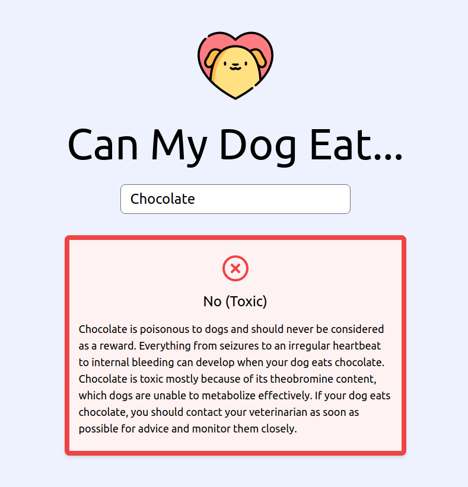

# Can My Dog Eat

A simple tool that tells you what food is safe for your dog.

[View website](https://canmydogeat.netlify.app/)

## Features

**Can My Dog Eat** is a simple website where you can look up information for over 100 types of food in regards to feeding them to your dog. Most common food types are included along with a breakdown of what, why and how to feed them to your dog. Just start typing in the search box, select one of the suggested results and learn all you need to know.

## Disclaimer

**Can My Dog Eat** does not provide medical advice. The information, including but not limited to, text, graphics, images and other materials contained are for informational purposes only. None of the provided material is intended to be a substitution for professional veterinarian advice, diagnosis or treatment. Always seek the advice of your veterinarian with any questions you may have regarding how to feed or medicate your pet. Never disregard professional advice or delay in seeking it because of something you have read on this website!

## Credits

Designed and developed by [Isabelle Viktoria Maciohsek](https://github.com/Trinityyi) © 2021
Built using [React](https://reactjs.org/) and [Tailwind](https://tailwindcss.com/)
Icons made by [Feather](https://feathericons.com/) and [Freepik](https://www.freepik.com/) from [www.flaticon.com](https://www.flaticon.com/)

## License

The project is licenses under the MIT License.
